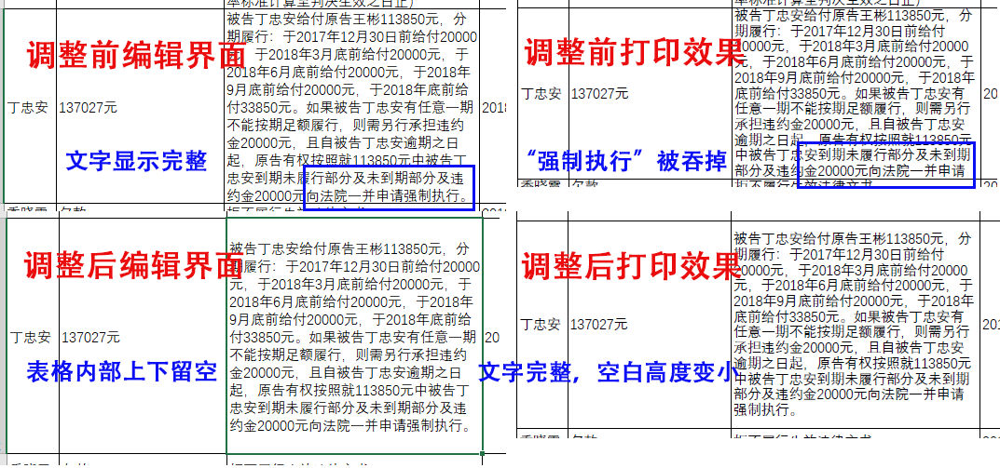

### 本程序能够实现：

* 在用户指定的列宽下，自动地批量拉大行高，确保在 Excel 编辑界面，文字内容不会顶着单元格边界，至少会留有一定的空白，看起来相对美观
* 在工作表行数多、但单个单元格文字量不大的场景下，杜绝编辑界面无误、但打印出来的字被“吞掉”的现象

### 本程序不能实现：

* 单元格填充大量文字的场景下，打印出来的页面能完整显示单元格的所有内容（Excel 打印跨页问题）

### 本程序特色：

* 具体该拉多高，由该行字号大小、该行单元格文字量确定(不是写死的固定值)。字号越大，文字量越多，拉出来的空白越多
* 必须要缩小字号才能拉高的单元行，会用黄底色标出
* 即使缩小了字号，也无法按照设定好的比例拉高的单元行，会用红底色标出

### 运行效果

### 程序原本目的（可惜没能实现）

打印 Excel 表格时，经常出现编辑时显示的页面和打印预览显示的的不一致，而打印预览就是最终在纸上显示的内容。通常表现为，打印预览的表格，某些单元格最上面或最下面只能显示字的一半，甚至最后面会少字，但编辑状态下没有问题。

概括来讲，Excel 所见非所得

这个困扰，时不时地出现在打印招投标文件、产品技术参数说明书等场景下。要命的是，这些打印场景，不允许半点差错。即便你设置了自动适应行宽、自动适应行高，也不一定能解决问题，字被“吃掉”的现象依然存在。

表格数据较少的时候，可以人工逐行检查，手工拉大行高**也许**能够解决（一般不会拉宽，因为你不会希望打印出来的表格横向跨页）。但如果数据非常大，人眼比对，不仅效率低，效果也不好。

对，你没有看错，手工拉大行高确实是有可能解决问题，也有可能解决不了，因为会涉及到 Excel 打印纵向跨页，在某一个单元格文字暴多的场景下拉大行高，也不一定能保证打印时文字能完全显示（这就是目的没达到的原因，解决 Excel 打印“吃字”难题，不是简单地拉高就 OK 的）。

Excel编辑界面和打印预览不一致，本质原因是显示器和打印机的DPI不对应。Excel表格的宽度，以字符和像素数表示，高度以磅和像素数表示，并不是物理上的长度单位。运气好，显示器和打印机DPI适配，所见即所得；运气不好，部分字就会被“吃掉”。

目前，可以通过调显示器分辨率（一般是降低）。经测试，我的这台23.8寸 1920X1080 的显示器，搭载 win7 及以上操作系统，使用 Adobe PDF 打印机标准模式时，设置显示字体放大 125%，屏幕显示的和打印的就一致起来。但调分辨率，不仅麻烦、影响显示效果，而且成功率低。

所以，咋办呢？？？

**亲，请你用 Word 吧！**